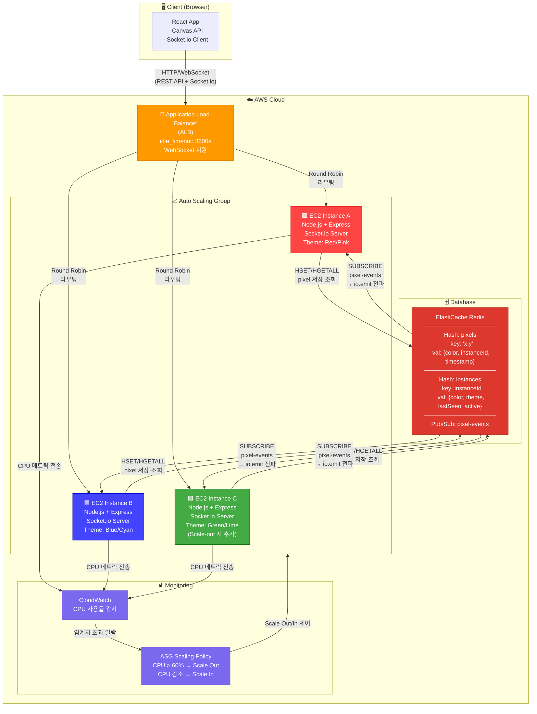
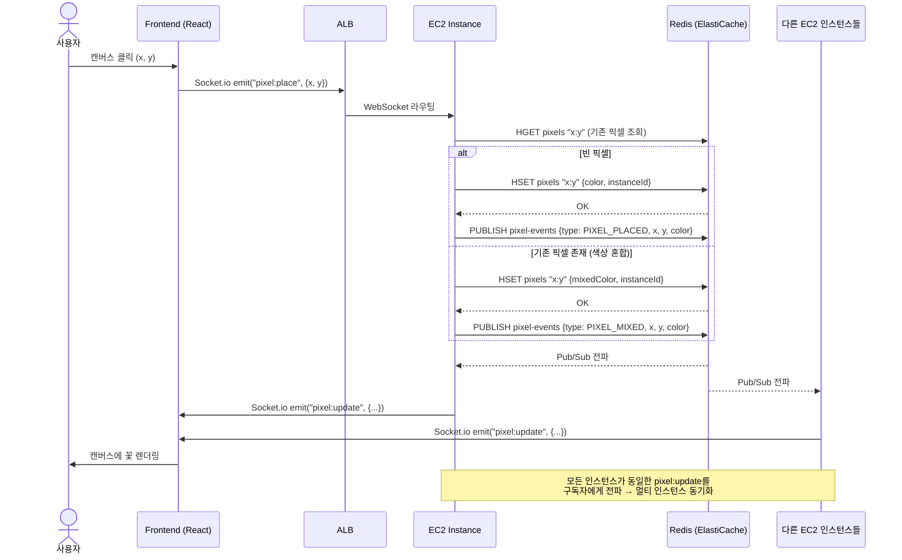
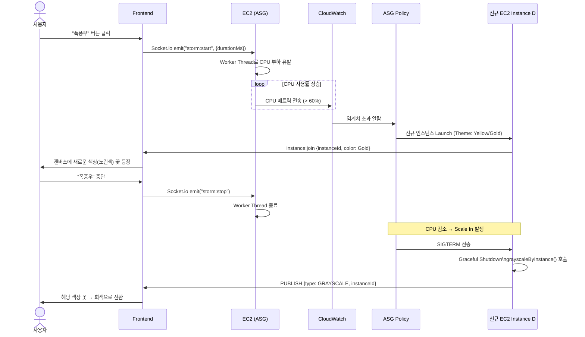
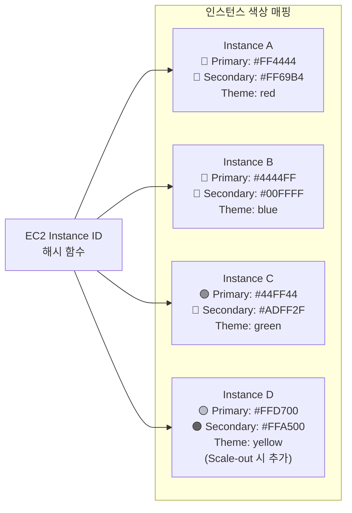

# PixelFlora Architecture Diagram

```mermaid
graph TB
    subgraph Client["🖥️ Client (Browser)"]
        UI["React App\n- Canvas API\n- Socket.io Client"]
    end

    subgraph AWS["☁️ AWS Cloud"]
        ALB["🔀 Application Load Balancer\n(ALB)\nidle_timeout: 3600s\nWebSocket 지원"]

        subgraph ASG["📈 Auto Scaling Group"]
            direction TB
            EC2A["🟥 EC2 Instance A\nNode.js + Express\nSocket.io Server\nTheme: Red/Pink"]
            EC2B["🟦 EC2 Instance B\nNode.js + Express\nSocket.io Server\nTheme: Blue/Cyan"]
            EC2C["🟩 EC2 Instance C\nNode.js + Express\nSocket.io Server\nTheme: Green/Lime\n(Scale-out 시 추가)"]
        end

        subgraph Monitoring["📊 Monitoring"]
            CW["CloudWatch\nCPU 사용률 감시"]
            ASGPolicy["ASG Scaling Policy\nCPU > 60% → Scale Out\nCPU 감소 → Scale In"]
        end

        subgraph Database["🗄️ Database"]
            Redis["ElastiCache Redis\n─────────────────\nHash: pixels\n  key: 'x:y'\n  val: {color, instanceId, timestamp}\n─────────────────\nHash: instances\n  key: instanceId\n  val: {color, theme, lastSeen, active}\n─────────────────\nPub/Sub: pixel-events"]
        end
    end

    %% Client ↔ ALB
    UI -- "HTTP/WebSocket\n(REST API + Socket.io)" --> ALB

    %% ALB ↔ EC2 (Round Robin)
    ALB -- "Round Robin\n라우팅" --> EC2A
    ALB -- "Round Robin\n라우팅" --> EC2B
    ALB -- "Round Robin\n라우팅" --> EC2C

    %% EC2 ↔ Redis
    EC2A -- "HSET/HGETALL\npixel 저장·조회" --> Redis
    EC2B -- "HSET/HGETALL\npixel 저장·조회" --> Redis
    EC2C -- "HSET/HGETALL\npixel 저장·조회" --> Redis

    %% Redis Pub/Sub
    Redis -- "SUBSCRIBE\npixel-events\n→ io.emit 전파" --> EC2A
    Redis -- "SUBSCRIBE\npixel-events\n→ io.emit 전파" --> EC2B
    Redis -- "SUBSCRIBE\npixel-events\n→ io.emit 전파" --> EC2C

    %% Monitoring
    EC2A -- "CPU 메트릭 전송" --> CW
    EC2B -- "CPU 메트릭 전송" --> CW
    EC2C -- "CPU 메트릭 전송" --> CW
    CW -- "임계치 초과 알람" --> ASGPolicy
    ASGPolicy -- "Scale Out/In 제어" --> ASG

    %% Styling
    classDef ec2Red fill:#FF4444,color:#fff,stroke:#cc0000
    classDef ec2Blue fill:#4444FF,color:#fff,stroke:#0000cc
    classDef ec2Green fill:#44AA44,color:#fff,stroke:#006600
    classDef redis fill:#DC382D,color:#fff,stroke:#aa0000
    classDef alb fill:#FF9900,color:#fff,stroke:#cc7700
    classDef cw fill:#7B68EE,color:#fff,stroke:#5a4fcf

    class EC2A ec2Red
    class EC2B ec2Blue
    class EC2C ec2Green
    class Redis redis
    class ALB alb
    class CW,ASGPolicy cw
```

## 데이터 흐름 (Sequence)

```mermaid
sequenceDiagram
    actor User as 사용자
    participant FE as Frontend (React)
    participant ALB as ALB
    participant EC2 as EC2 Instance
    participant Redis as Redis (ElastiCache)
    participant Others as 다른 EC2 인스턴스들

    User->>FE: 캔버스 클릭 (x, y)
    FE->>ALB: Socket.io emit("pixel:place", {x, y})
    ALB->>EC2: WebSocket 라우팅

    EC2->>Redis: HGET pixels "x:y" (기존 픽셀 조회)
    alt 빈 픽셀
        EC2->>Redis: HSET pixels "x:y" {color, instanceId}
        Redis-->>EC2: OK
        EC2->>Redis: PUBLISH pixel-events {type: PIXEL_PLACED, x, y, color}
    else 기존 픽셀 존재 (색상 혼합)
        EC2->>Redis: HSET pixels "x:y" {mixedColor, instanceId}
        Redis-->>EC2: OK
        EC2->>Redis: PUBLISH pixel-events {type: PIXEL_MIXED, x, y, color}
    end

    Redis-->>EC2: Pub/Sub 전파
    Redis-->>Others: Pub/Sub 전파
    EC2->>FE: Socket.io emit("pixel:update", {...})
    Others->>FE: Socket.io emit("pixel:update", {...})
    FE->>User: 캔버스에 꽃 렌더링

    Note over EC2,Others: 모든 인스턴스가 동일한 pixel:update를<br/>구독자에게 전파 → 멀티 인스턴스 동기화
```

## Storm Mode & Auto Scaling 흐름

```mermaid
sequenceDiagram
    actor User as 사용자
    participant FE as Frontend
    participant EC2 as EC2 (ASG)
    participant CW as CloudWatch
    participant ASGPolicy as ASG Policy
    participant NewEC2 as 신규 EC2 Instance D

    User->>FE: "폭풍우" 버튼 클릭
    FE->>EC2: Socket.io emit("storm:start", {durationMs})
    EC2->>EC2: Worker Thread로 CPU 부하 유발

    loop CPU 사용률 상승
        EC2->>CW: CPU 메트릭 전송 (> 60%)
    end

    CW->>ASGPolicy: 임계치 초과 알람
    ASGPolicy->>NewEC2: 신규 인스턴스 Launch (Theme: Yellow/Gold)
    NewEC2->>FE: instance:join {instanceId, color: Gold}
    FE->>User: 캔버스에 새로운 색상(노란색) 꽃 등장

    User->>FE: "폭풍우" 중단
    FE->>EC2: Socket.io emit("storm:stop")
    EC2->>EC2: Worker Thread 종료

    Note over NewEC2,ASGPolicy: CPU 감소 → Scale In 발생
    ASGPolicy->>NewEC2: SIGTERM 전송
    NewEC2->>NewEC2: Graceful Shutdown\ngrayscaleByInstance() 호출
    NewEC2->>FE: PUBLISH {type: GRAYSCALE, instanceId}
    FE->>User: 해당 색상 꽃 → 회색으로 전환
```

## 인스턴스 색상 매핑

```mermaid
graph LR
    subgraph ColorMap["인스턴스 색상 매핑"]
        A["Instance A\n🔴 Primary: #FF4444\n🌸 Secondary: #FF69B4\nTheme: red"]
        B["Instance B\n🔵 Primary: #4444FF\n🩵 Secondary: #00FFFF\nTheme: blue"]
        C["Instance C\n🟢 Primary: #44FF44\n💚 Secondary: #ADFF2F\nTheme: green"]
        D["Instance D\n🟡 Primary: #FFD700\n🟠 Secondary: #FFA500\nTheme: yellow\n(Scale-out 시 추가)"]
    end

    HashFn["EC2 Instance ID\n해시 함수"] --> A
    HashFn --> B
    HashFn --> C
    HashFn --> D
```
